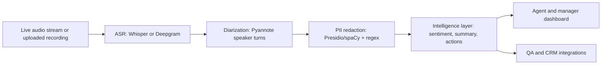

# VoiceOps Sentinel

Real-Time Call Intelligence system for customer support quality assurance.

VoiceOps Sentinel ingests support-call audio, produces a diarized transcript, redacts PII, detects sentiment shifts, and generates an actionable manager-ready summary.

## What Is Included

- FastAPI backend for audio upload and call processing
- Pluggable ASR layer with OpenAI Whisper support and a deterministic demo fallback
- Speaker diarization abstraction for Pyannote integration
- PII redaction with regex patterns plus optional spaCy NER
- LLM-style intelligence layer for summaries, sentiment shifts, and action items
- Minimal dashboard UI with audio playback, timestamped transcript, redaction view, and insights
- Browser live transcript mode for microphone-based capture and transcript analysis
- 4-week implementation plan and production roadmap

## Quick Start

```powershell
python -m venv .venv
.\.venv\Scripts\Activate.ps1
pip install -r requirements.txt
uvicorn app.main:app --reload
```

Open:

```text
http://127.0.0.1:8000
```

The app does not silently use fake call content. For dependable real-call transcription across mp3, wav, flac, m4a, ogg, webm, mp4, mpeg, and mpga, configure OpenAI transcription:

```powershell
$env:OPENAI_API_KEY="your_key"
$env:VOICEOPS_TRANSCRIBER="auto"
```

Or create a local `.env` file from `.env.example`. When no API key is present, the app can still use the Windows Speech recognizer for WAV files, but that is only a local fallback and is less accurate.

To force sample data for demos only:

```powershell
$env:VOICEOPS_TRANSCRIBER="demo"
```

Optional diarization and PII tools:

```powershell
$env:VOICEOPS_DIARIZER="pyannote"
$env:HUGGINGFACE_TOKEN="your_token"
$env:VOICEOPS_USE_SPACY="true"
python -m spacy download en_core_web_sm
```

## API

### `POST /api/calls`

Upload an audio file as multipart form data:

```text
file: mp3, wav, flac, m4a, ogg, webm, mp4, mpeg, or mpga
```

Returns:

- `transcript`: timestamped speaker turns
- `redacted_transcript`: PII-safe transcript text
- `sentiment_events`: detected happy/angry/escalation moments
- `summary`: concise call summary
- `action_items`: concrete follow-up tasks
- `metrics`: latency, duration estimate, and redaction counts

### `GET /api/health`

Health check endpoint.

### `POST /api/transcripts`

Analyze a transcript captured from the browser or pasted manually:

```json
{
  "source_name": "live-browser-transcript",
  "transcript": "Agent: Thanks for calling support...\nCustomer: I am angry because..."
}
```

This route runs the same redaction, sentiment, summary, and action-item extraction pipeline as uploaded audio.

## Real-Time Capture

The dashboard includes two capture modes:

- **Upload/record audio:** sends audio to the backend. For dependable real-call transcription across formats, configure `OPENAI_API_KEY`.
- **Live Transcript:** uses browser speech recognition where available, lets the user review the captured transcript, then analyzes it immediately.

Without an API key, the app will not silently invent call content. It can use the Windows Speech recognizer for WAV files as a local fallback, and demo mode is only enabled when `VOICEOPS_TRANSCRIBER=demo`.

## Production Architecture



## 4-Week Implementation Plan

| Week | Goal | Deliverables | Review Focus |
|---|---|---|---|
| 1 | Transcription Pipeline | Whisper API integration, upload handling for mp3/wav/flac/m4a/ogg, normalized timestamp segments | WER checks on noisy real-world support calls |
| 2 | Intelligence Layer | Summaries, action item extraction, sentiment shift detection on transcript chunks | Latency from audio completion to final insight |
| 3 | Diarization & PII | Pyannote speaker labeling, PII scrubbing for names, phones, emails, cards, account-like numbers | Privacy audit with mock sensitive calls |
| 4 | Final Packaging | Dashboard with audio player, synced transcript, redaction view, simulated live feed mode | End-to-end demo and integration readiness |

## Notes For Production

- Use Deepgram streaming or OpenAI real-time APIs for lower-latency live call ingestion.
- Store only redacted transcripts by default; keep raw transcripts behind strict retention controls.
- Add human QA review states before automatically writing summaries to a CRM.
- Track WER, diarization error rate, redaction recall, summary usefulness, and action-item precision.
